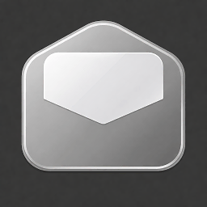

# MyEmail



A macOS email client built for power users who need correctness under load — multiple accounts, large archives, unstable networks, and external clients modifying the mailbox in parallel.

Inspired by MailMate and Thunderbird. No AI, no tabs, no Liquid Glass.

## Requirements

- macOS 15.0 (Sequoia) or later
- arm64 or x86_64

## Features

- **Multi-account** — Gmail (OAuth2 + PKCE) and generic IMAP/SMTP with password
- **Unified Inbox** — virtual aggregation of all account inboxes in one view
- **Two layouts** — Wide (NavigationSplitView) and Classic (HSplitView) with persistent state
- **Offline-capable** — full read/compose/search while offline; actions queued and replayed on reconnect
- **Full-text search** — FTS5, instant, across all accounts and folders
- **IDLE push** — real-time delivery on INBOX and selected folder; STATUS polling on others
- **Customizable toolbar and columns** — NSToolbar bridge, per-column width and visibility
- **HTML rendering** — WKWebView with JavaScript disabled, remote content blocked by default
- **Local-only** — no telemetry, no cloud sync, no developer servers

## Tech Stack

| Layer | Technology |
|-------|------------|
| UI | SwiftUI + `@Observable`, `NSToolbar` bridge |
| Persistence | GRDB.swift (SQLite, WAL, ValueObservation) |
| Full-text search | FTS5 via GRDB |
| IMAP / SMTP | SwiftMail (Cocoanetics) + IMAPRawClient (NWConnection) |
| MIME parsing | SwiftEmailParser |
| HTML rendering | WKWebView, JS disabled |
| OAuth2 | ASWebAuthenticationSession + PKCE (RFC 8252) |
| Keychain | `kSecAttrAccessibleAfterFirstUnlock` |

## Building

Open `MyEmail.xcodeproj` in Xcode 16+ and build the `MyEmail` scheme.

To build a signed distributable DMG:

```sh
scripts/build-dmg.sh
```

## Project Structure

```
MyEmail/
├── App/          # Entry point, AppState, app-level setup
├── Models/       # GRDB records (Message, Account, Folder, …)
├── Services/     # SyncService, IMAPService, SMTPService, AuthService, …
├── Views/        # SwiftUI views and subcomponents
├── Utilities/    # IMAP-UTF-7, HTML sanitizer, logging, …
└── Shared/       # Cross-cutting types and extensions
```

## Logging

All runtime logs are written via `LogService`. Press **⌥⌘Y** to open the debug log panel — no Xcode or Console.app needed.

## License

MIT — see [LICENSE](LICENSE).

## Privacy

All data stays on your device. See [PRIVACY_POLICY.md](PRIVACY_POLICY.md) for details.
